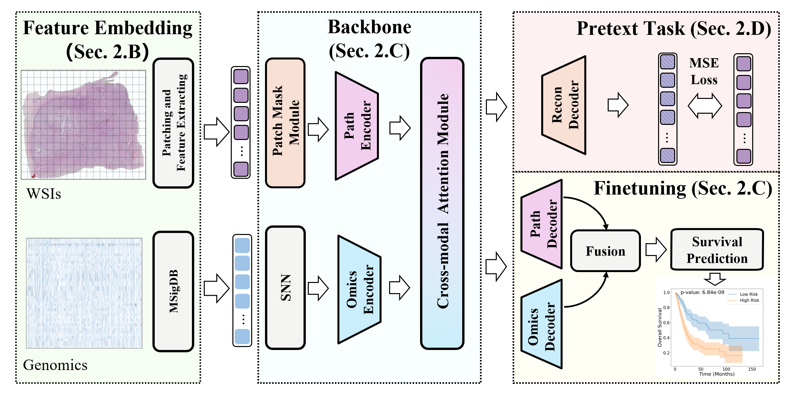

# GMSL

Genomics-Aware Multimodal Self-Supervised Learning for Cancer Survival Prediction, (Accepted to BIBM 2025).

*Kaiwen Sun, Yuting Guo, Yuanbo He, Zining Liu, Jiahao Cui, Shuai Li*




---

## Prerequisites


<details style="color:rgb(128,128,128)">
<summary>Sharing My Hardware and Software Configuration (For Reference Only)</summary>

* CPU: Intel(R) Core(TM) i7-13700KF CPU @ 3.40 GHz
* RAM: 64 GB
* GPU: NVIDIA GeForce RTX 4090 (24GB)
* Ubuntu 22.04
</details>


```text
python 3.8.20
pytorch 2.4.1
pytorch-cuda 11.8
numpy 1.24.1
pandas 2.0.3
Pillow 10.2.0
scikit_learn 1.3.2
scikit_survival 0.22.2
tqdm 4.66.5
nystrom-attention 0.0.12
thop 0.1.1-2209072238
psutil 6.1.0
```

torch==2.4.1
torchvision==0.19.1

---


## Data prerpocessing


### WSIs data
1. Download diagnostic WSIs from [TCGA](https://portal.gdc.cancer.gov/).
2. Use the [CLAM](https://github.com/mahmoodlab/CLAM) to extract resnet-50 pretrained 1024-dim feature for each 512 x 512 patch.

### Genomics and clinical data

1. Download genomics and clinical data from [CbioPortal](https://www.cbioportal.org/). 
2. Use the [Data Processing code](preprocess/data_processing/readme-s.md) to process the genomics and clinical data.

---
## Running Experiments

Commands for all experiments can be found in the [scripts](scripts).


---


## Acknowledgements
Huge thanks to the authors of following open-source projects:
- [CLAM](https://github.com/mahmoodlab/CLAM)
- [PathOmics](https://github.com/Cassie07/PathOmics)
- [CMTA](https://github.com/FT-ZHOU-ZZZ/CMTA)
- [mae](https://github.com/facebookresearch/mae)

